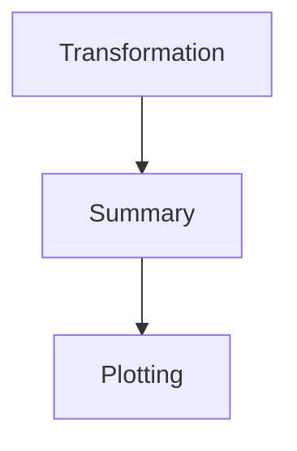

# Nez deployer

Source code and executable of the Nez's deployer. This tool reads a configuration file containing the description of a processing system (e.g., a workflow or a pipeline). It automatically deploys each stage in the file creating a dataflow from a data source.

## How to create a system?

### Stages contenerization

You must to create a virtual container with the following tree structure:

```
.
├── API
│   ├── main.py
│   └── requirements.txt
├── app
│   └── main.py
├── Dockerfile
└── requirements.txt
```

The API directory contains an input interface to make the container calleable from remote locations. 

Build your virtual container as follows:

```bash
docker build -t mycontainer:v1 .
```

You can also build your own virtual container images by extending the Nez base image:

```bash
docker pull ddomizzi/basenez:v1
```

For example:

```Dockerfile
FROM ddomizzi/basenez:v1

ADD ./app .

# Rest of the Dockerfile
...
```

### Creation of a Nez configuration file

A Nez system is created from a configuration file that contains all the specifications of the stages in the system. This file is composed of four main sections: building blocks ```BBs```, ```patterns```, ```stages```, and ```workflow```.

#### 📦 [BB] - Building Blocks

Each `[BB]` defines a **containerized processing task** with its command and Docker image.

| Field     | Description |
|-----------|-------------|
| `name`    | Unique task identifier |
| `command` | Command to execute inside the container. It uses some wildcards to make abstract references to the input and output data within a command. `@I` is the input path, `@D` is the directory where the task produce its outputs, `@N` makes reference to the filename of an input without extension, `@N` makes reference to the filename of an input with extension |
| `image`   | Docker image name and tag used for this task |

#### Example

```ini
[BB]
name = Anonimizacion
command = python3 /code/process_dir.py --input @I --outfolder "@D" --save dicom
image = ddomizzi/cleaner:header
[END]
```

In this case, the ```Anonimization``` block process the input file ```@I``` and saves the results in the directory ```@D```, which in runtime is replaced by the path to the workspace of the block.

---

### 🧩 [PATTERN] - Execution Patterns

Each `[PATTERN]` defines how a building block is executed across distributed resources.

| Field        | Description |
|--------------|-------------|
| `name`       | Pattern identifier |
| `task`       | Task name from a `[BB]` block |
| `pattern`    | Parallelism pattern (`MW` = Manager/Worker) |
| `workers`    | Number of worker processes |
| `loadbalancer` | Load-balancing strategy (e.g., `TC:DL` for load-balancing at directory level, and `TC:F`) for load-balancing at file level. |

#### Example

```ini
name = ToRGBpattern
task = ToRGB
pattern = MW
workers = 2
loadbalancer = TC:DL
```

---

### 🚦 [STAGE] - Workflow Stages

Each `[STAGE]` defines a step in the workflow and connects to adjacent stages using `source` and `sink`.

| Field            | Description |
|------------------|-------------|
| `name`           | Stage name |
| `source`         | Input data source: a catalog, a path on the file system, or previous stage |
| `sink`           | Next stage (optional) |
| `transformation` | Pattern to apply (from `[PATTERN]`) |


#### Example 

```
[STAGE]
name = stage_ToRGB
source = stage_Anonimizacion 
sink = stage_DetectorPulmon 
transformation = ToRGBpattern
[END]
````

---

## 📚 [WORKFLOW] - Workflow Definition

The `[WORKFLOW]` block defines the complete workflow structure.

| Field     | Description |
|-----------|-------------|
| `name`    | Workflow name |
| `stages`  | Ordered list of stages |
| `catalogs` (optional) | External input catalogs used by the first stage |

```ini
[WORKFLOW]
name = MyPuzzle
stages = stage_Anonimizacion stage_ToRGB stage_DetectorPulmon 
catalogs = TESTCATALOG:6893389c97b613470d62063824e26cb3afeea32b817f7b4ccc57a3714a40643d 
[END]
```

---

### Example

The directory ```example``` contains an example of a configuration file with the following flow:




* ``` Transformation``` is a microservice that transforms XML files into JSON files.

* ```Summary``` gets the average values for each element in the JSON files.

* ```Plotting``` creates a simple graphical representation.

```
.
├── datasource
│   ├── 001.xml
│   ├── 002.xml
│   └── 003.xml
├── microservices
│   ├── report
│   │   ├── API
│   │   │   ├── main.py
│   │   │   └── requirements.txt
│   │   ├── app
│   │   │   └── main.py
│   │   ├── Dockerfile
│   │   └── requirements.txt
│   ├── summary
│   │   ├── API
│   │   │   ├── main.py
│   │   │   └── requirements.txt
│   │   ├── app
│   │   │   └── main.py
│   │   ├── Dockerfile
│   │   └── requirements.txt
│   └── transform
│       ├── API
│       │   ├── main.py
│       │   └── requirements.txt
│       ├── app
│       │   └── main.py
│       ├── Dockerfile
│       └── requirements.txt
└── myflow.cfg
```

The file ```myflow.cfg``` contains the declaration of the stages in the flow. 

> IMPORTANT!: Modify the path in the line 45 with the correct path to the source files (```datasource``` in the example directory).

### Example execution

Before running this example, you must to modify the file '''example/docker-compose.yml''', in specific the paths in lines 11 and 13.

```YAML
services:
  deployer: #Servicio para el despliegue de sistemas de e-salud
    image: ddomizzi/deployernez:v1
    command: "tail -f /dev/null"
    tty: true
    restart: unless-stopped
    volumes:
      - "/var/run/docker.sock:/var/run/docker.sock"
      - "./:/example"
      - "../src:/home/app"
      - "PATH/TO/NEZ/SRC:PATH/TO/NEZ/SRC"
    environment:
      HOST_PATH: PATH/TO/NEZ/SRC

```

To run this example, first you must to deploy Nez using the ```docker-compose.yml``` file.

```bash
docker compose up -d
```

Now enter into the deployer container as follows:

```bash
docker compose exec deployer bash
```

In the container, execute the following command to deploy the service:

```bash
./puzzlemesh/puzzlemesh -c /example/myflow.cfg -m compose
```

Now, execute the following command to run the service:

```bash
./puzzlemesh/puzzlemesh -c /example/myflow.cfg -m compose -exec True
```

You can see the outputs of your service in the following path:

```
PROJECT_ROOT
|--src
|----results
```

---

## 🧠 Notes

- Variables like `@I`, `@D`, and `@L` are resolved at runtime.
- `MW` stands for **Manager/Worker** model.
- Load balancer `TC:DL` indicates **Task Controller: Data Locality** strategy.
- Each `[STAGE]` connects to the next via `sink`.